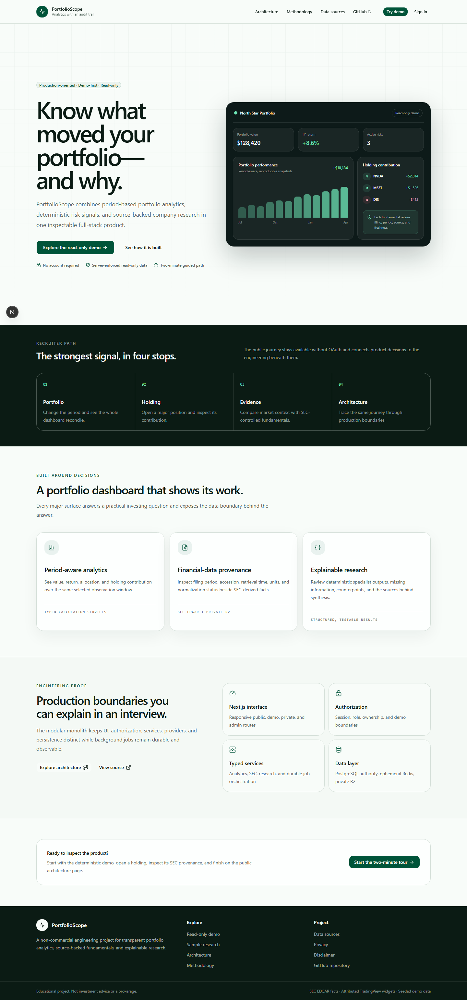
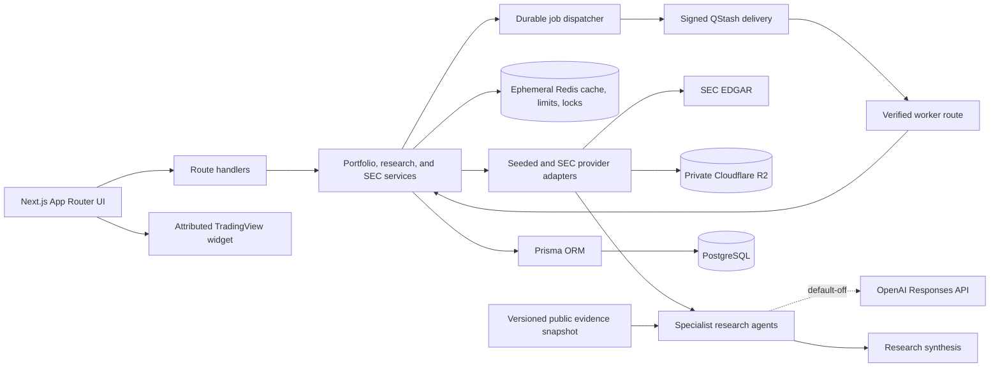

# PortfolioScope

PortfolioScope is a full-stack stock dashboard for managing portfolios, following
stocks, reviewing company fundamentals, and simplifying stock research. It is
built for beginner-to-intermediate investors and doubles as a recruiter-ready
example of a secure, tested, deployable application.

> This is an educational analytics demo, not a brokerage or financial-advice product. PortfolioScope fundamentals come from SEC EDGAR when ingested, market charts are attributed TradingView widgets, and portfolio/research fixtures remain deterministic and seeded. Optional AI research interprets only supplied public evidence; it is disabled by default and is not itself a financial-data source. The app does not place trades, predict prices, or issue buy/sell/hold recommendations.

## Product highlights

- One-click, deterministic, read-only demo
- Private portfolios, holdings, watchlists, alerts, and research history
- Portfolio performance, allocation, gain/loss, and holding contribution views
- Stock pages with attributed TradingView charts and persisted SEC fundamentals
- Clear missing, stale, partial, and error states
- GitHub and Google sign-in through Auth.js
- Responsive Next.js UI backed by typed services, Prisma, and PostgreSQL

The visible product is intentionally smaller than the implementation underneath.
For technical reviewers, the repository includes owner-scoped authorization,
SEC ingestion and internal provenance, private raw-source storage, durable signed
jobs, caching and rate limits, monitoring, backups, CI/CD, and a default-off,
budget-capped evidence-grounded AI architecture.

## Product tour

The public landing page leads into a deterministic, read-only product demo. The
checked-in assets are generated from the seeded application with
`npm run demo:capture`; the current narration and fallback path are in
[`DEMO.md`](DEMO.md).



| View         | What it demonstrates                                                     |
| ------------ | ------------------------------------------------------------------------ |
| Landing      | Clear product positioning and one-click demo entry                       |
| Dashboard    | Portfolio summary, allocation, performance, and alert context            |
| Holdings     | Comparable return windows and position-level performance                 |
| Watchlist    | Stocks the user follows, with editable notes and targets where supported |
| Alerts       | Explainable rules linked to affected securities                          |
| Stock detail | Market context, financial facts, and structured research                 |

The short walkthrough recording is available at [`public/demo/recruiter-tour.webm`](public/demo/recruiter-tour.webm).

Product routes stay focused on the dashboard, holdings, watchlist, alerts, stock
detail, and research. Architecture, methodology, data-source, security, and
operations detail remains in repository documentation.

### Technical project summary

- Built a production-oriented Next.js stock dashboard with typed portfolio services, Prisma/PostgreSQL persistence, responsive visualizations, and deterministic fixtures.
- Designed owner-scoped Auth.js workflows, a server-enforced read-only public demo, explicit admin authorization, signed/idempotent background jobs, and privacy-safe observability.
- Integrated SEC EDGAR provenance and private raw-source retention while preserving ambiguity, freshness, and missing-data states alongside attributed TradingView market context.

## Architecture



The application keeps presentation, orchestration, domain calculations, providers, and persistence separate. Providers supply facts; specialist agents interpret structured inputs; synthesis combines their outputs while preserving findings, confidence, warnings, and sources.

## Tech stack

- Next.js 16, React 19, and TypeScript
- Tailwind CSS and shadcn/ui-style components
- Recharts for portfolio and stock visualizations
- Prisma ORM and PostgreSQL
- Auth.js with the Prisma adapter and GitHub/Google OAuth
- Zod for runtime validation
- SEC EDGAR submissions and Company Facts APIs
- Cloudflare R2 through the server-only AWS S3 client
- Upstash Redis and QStash for ephemeral coordination and signed delivery
- Attributed TradingView widgets for public market charts
- Vitest for unit and route-level integration tests
- ESLint, Docker, and GitHub Actions

## Run locally

Prerequisites: Node.js 20.19+, npm, and Docker Desktop (or another PostgreSQL 16 instance).

```bash
git clone <your-repository-url>
cd PortfolioScope
cp .env.example .env
npm ci
docker compose up -d postgres
npm run db:deploy
npm run db:seed
npm run dev
```

On Windows PowerShell, replace the copy command with `Copy-Item .env.example .env`.

Open [http://localhost:3000](http://localhost:3000), then select **Continue as demo investor**. The default `.env.example` credentials match the local Docker database.

The demo does not require OAuth. To test real sign-in locally, generate
`AUTH_SECRET`, create local GitHub and Google OAuth applications, and configure
the callback URLs documented in [`RUNBOOK.md`](RUNBOOK.md). Never reuse
Production OAuth credentials in Preview or local environments.

SEC ingestion is optional for the seeded local demo. To exercise M14, configure
the SEC and R2 values from `.env.example`, apply migrations and seed the
supported-company registry, assign a trusted test identity `ADMIN`, then use the
single-ticker `POST /api/admin/sec/ingest` operation documented in
[`RUNBOOK.md`](RUNBOOK.md). Page rendering never makes a live SEC request.

M15 background work is also opt-in. Keep its three feature flags `false` for
the normal seeded demo. To exercise jobs, configure environment-isolated Redis
and QStash credentials, apply both M15 migrations, verify the signed callback,
then enable workloads in the order documented in [`RUNBOOK.md`](RUNBOOK.md).

M18 external research is separately opt-in and is not needed for the local
demo. Keep `AI_RESEARCH_ENABLED=false` unless the additive M18 migration,
public-evidence boundary, OpenAI credential, provider-side billing alerts, and
the application quotas have been verified in that environment. See
[`docs/ai-research.md`](docs/ai-research.md) for the activation and rollback
sequence.

Local verification has successfully applied migrations
`20260811120000_m18_ai_research_foundation` and
`20260811130000_m18_bind_ai_generation_config`; all eight dedicated M18
database integration cases pass. Preview and Production must still apply and
verify both migrations independently with external AI disabled.

## Quality checks

```bash
npm run verify
```

Run the deeper checks when the changed surface requires them:

```bash
npm run verify:db
npm run test:integration
npm run test:e2e
npm run verify:security
```

CI uses the same package entrypoints against an isolated PostgreSQL service after
applying migrations and loading deterministic demo data.

## Demo guide

The focused recruiter walkthrough takes about two minutes:

1. Start on the landing page and enter the read-only demo without an account.
2. Use the guided dashboard prompt to inspect period analytics and a holding.
3. Open a stock page and distinguish attributed market context from persisted financial facts.
4. Open the deterministic sample research, then use the repository documentation for engineering depth.

Detailed talking points, fallback steps, and screenshot framing are in [`DEMO.md`](DEMO.md).

## Deployment

The M11 deployment foundation targets Vercel and Neon PostgreSQL. Runtime traffic uses the pooled `DATABASE_URL`; Prisma migration commands use the direct `DIRECT_URL`. Preview and production must use different Neon databases and environment-scoped Vercel variables.

The repository includes:

- GitHub Actions checks backed by PostgreSQL
- Safe, repeatable Prisma migrations and an idempotent demo-seed integration check
- `GET /api/health` for liveness and `GET /api/ready` for database readiness
- Optional Sentry client, server, edge, and App Router error instrumentation
- Durable demo-owner identification with collision-safe legacy seed adoption
- Auth.js GitHub/Google OAuth, database sessions, protected application/admin routes, and account lifecycle controls
- Centralized authorization helpers plus cross-user route, service, and PostgreSQL isolation tests
- A curated 25-company ticker/CIK registry and controlled admin-only SEC ingestion
- Private content-addressed R2 raw-source storage and normalized PostgreSQL facts
- Explicit missing, ambiguous, stale, failed, and unsupported fundamentals states
- Durable SEC, deterministic research, snapshot, and maintenance jobs with signed callbacks and admin diagnostics
- A versioned evidence-retrieval and structured-generation layer with normalized claims/citations, bounded repair, report reuse/diff utilities, and offline evaluation
- PostgreSQL-authoritative global, per-user, and per-job AI reservations with a checked-in `$5 USD` monthly application maximum and a default-off external-call kill switch
- Redis cache/lock/rate-limit policies plus two bounded QStash maintenance schedules
- Privacy-safe structured logs, request correlation, Sentry release/error context, and an admin-only dependency dashboard
- Explicit PostHog event contracts with autocapture, replay, and person profiles disabled
- CSP and production security headers with deliberate TradingView allowances
- Scheduled compressed PostgreSQL backups in private R2 storage, guarded non-production restore tooling, and retention tests
- Playwright critical-journey coverage plus Dependabot, CodeQL, Gitleaks, and dependency-audit automation
- A multi-stage production `Dockerfile` and local PostgreSQL in `docker-compose.yml`

Follow [`RUNBOOK.md`](RUNBOOK.md) for the environment matrix, first deployment, monitoring, smoke tests, and rollback procedure.

No public demo URL is claimed here until a deployment is verified.

## Project documentation

- [`docs/PRD.md`](docs/PRD.md) — authoritative product direction and non-goals
- [`docs/task-backlog.md`](docs/task-backlog.md) — canonical active roadmap, including M19 cancellation and M20-M28
- [`docs/task-backlog-part-2.md`](docs/task-backlog-part-2.md) — historical M11-M18 detail and superseded M19 proposal
- [`docs/architecture.md`](docs/architecture.md) — current technical architecture and planned architectural intent
- [`docs/deployment.md`](docs/deployment.md) — deployment and external-activation reference
- [`RUNBOOK.md`](RUNBOOK.md) — production operations, monitoring, and rollback
- [`DEMO.md`](DEMO.md) — current recruiter walkthrough and capture checklist
- [`PERFORMANCE.md`](PERFORMANCE.md) — repeatable M22 request-path conditions, traces, and before/after evidence
- [`MARKET_PRICES.md`](MARKET_PRICES.md) — M23 source decision, licensing evidence, freshness, and target-crossing semantics
- [`docs/sec-data.md`](docs/sec-data.md) — SEC contracts, normalization, provenance, freshness, and operations
- [`docs/ai-research.md`](docs/ai-research.md) and [`docs/ai-evaluation.md`](docs/ai-evaluation.md) — M18 safeguards and evaluation

## Roadmap

- M19 portfolio risk and scenario analytics is cancelled after a deliberate scope reassessment.
- M20-M23 product simplification, authenticated reliability, measured request-path work, cached demo watchlist prices, and target alerts are complete.
- M24-M26 plan simpler stock detail, three financial trend charts, and upcoming earnings.
- M27 separates controlled live AI activation from the completed M18 repository architecture.
- M28 is a low-priority, human-involved visual design pass after behavior is stable.

M24-M28 remain `NOT_STARTED`. No licensed market-price or earnings provider is
selected; a future service requires feasibility analysis plus human approval.
Brokerage connectivity, trading, institutional risk
analytics, generalized catalysts, price prediction, and investment
recommendations remain outside the product's scope.
