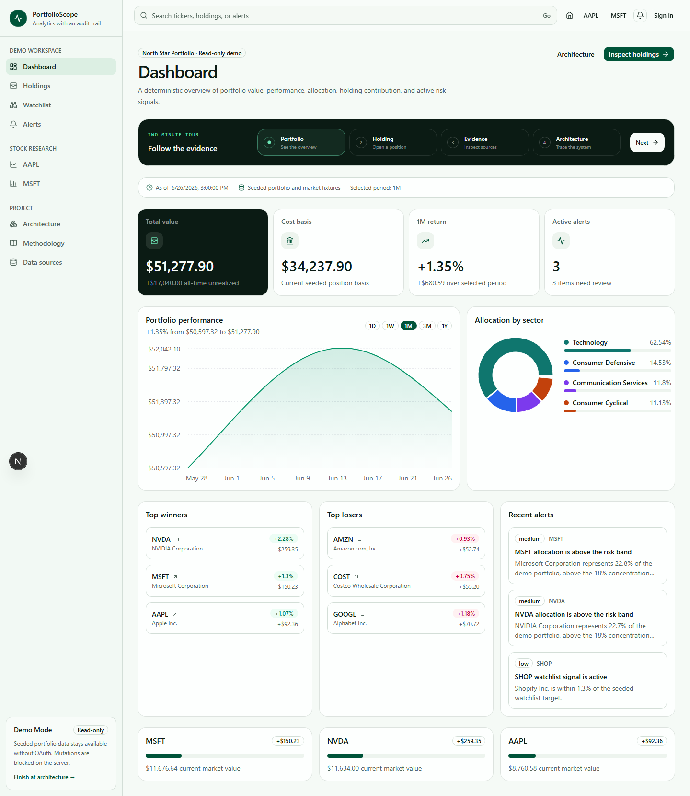
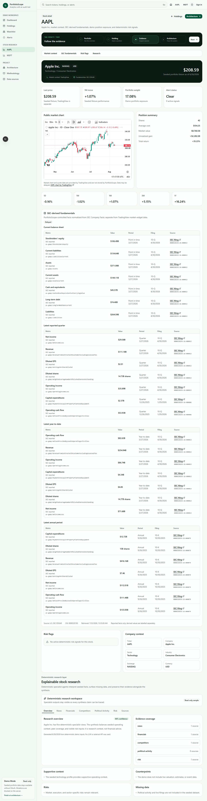
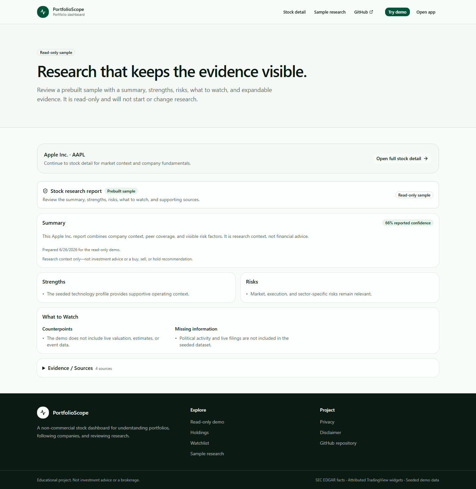
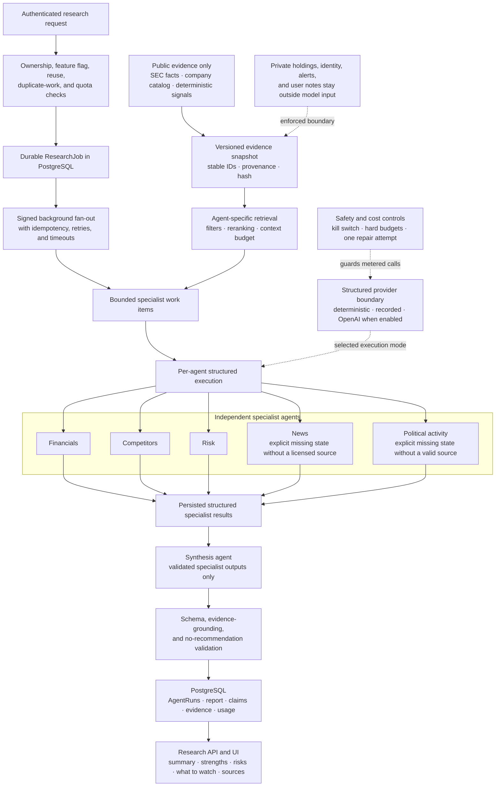

# PortfolioScope

PortfolioScope is a full-stack stock dashboard for tracking portfolios,
following companies, and reviewing evidence-backed stock research.

**Live application:** [portfolio-scope.vercel.app](https://portfolio-scope.vercel.app)



_Portfolio performance, allocation, gain/loss, and active alerts in the
read-only demo._

> Educational analytics project only. PortfolioScope is not a brokerage and
> does not provide financial advice or investment recommendations.

## Overview

PortfolioScope helps beginner-to-intermediate investors understand their
holdings, follow companies, and review key financial and research context. The
project also demonstrates how to build, secure, test, and operate a deployed
full-stack application.

## Live Demo

[Open the Production application](https://portfolio-scope.vercel.app). Explore
the seeded, read-only demo without an account, or sign in with GitHub or Google
to manage private data.

## Key Features

- Tracks portfolios, holdings, cost basis, allocation, and gain/loss.
- Compares portfolio and holding performance across common time periods.
- Manages watchlists with notes, cached prices, and price targets.
- Tracks upcoming earnings for companies in holdings and watchlists.
- Shows company profiles, attributed market charts, SEC-backed financials, and
  financial trends.
- Surfaces concentration, drawdown, volatility, price, and target alerts.
- Provides a public sample report and optional AI-assisted research with
  evidence, confidence, risks, and missing information.
- Supports GitHub and Google sign-in, private accounts, and a server-enforced
  read-only demo.

## Screenshots

### Stock detail



_Market context, portfolio exposure, company information, and links to
financials and research._

### Research report



_A concise report with strengths, risks, items to watch, and expandable
sources._

## Tech Stack

- Next.js 16, React 19, and TypeScript
- PostgreSQL and Prisma
- Auth.js with GitHub and Google OAuth
- Upstash Redis and QStash
- OpenAI Responses API
- Vercel

## How It Works

- Authenticated users manage owner-scoped portfolio, watchlist, alert, and
  research data.
- Provider data is validated and normalized before it reaches the UI.
- Stock research combines deterministic company data, SEC facts, and optional
  AI-assisted analysis.
- Background jobs handle longer-running ingestion, research, and maintenance
  work.

## AI Research Multi-Agent Workflow

The research layer fans a durable job out to focused specialists, then builds
one evidence-grounded report from their structured results. Model-assisted
generation is optional and default-off; deterministic and recorded providers
keep local development and automated tests reproducible.



Each material claim must cite supplied evidence. Missing data, counter-evidence,
and specialist disagreements remain visible through synthesis; the system does
not fill gaps from model memory or issue buy, sell, hold, allocation, or price
target instructions. See the [AI research design](docs/ai-research.md) for the
full data, safety, cost, and activation boundaries.

## Project Highlights

- Deployed full-stack application with a public read-only demo
- Private user data with server-side ownership checks
- Validated financial data with source and freshness information
- Durable background jobs with retry and duplicate-delivery controls
- Default-off AI generation with strict usage and cost limits
- Automated tests, CI checks, monitoring, and backups

## Local Development

Prerequisites: Node.js 20.19+, npm, and Docker Desktop or another PostgreSQL 16
instance.

```bash
git clone https://github.com/JasonServito/portfolio-scope.git
cd portfolio-scope
cp .env.example .env
npm ci
docker compose up -d postgres
npm run db:deploy
npm run db:seed
npm run dev
```

On Windows PowerShell, use `Copy-Item .env.example .env` instead of `cp`.

Open [http://localhost:3000](http://localhost:3000) and select **Explore the
read-only demo**. The seeded demo does not require OAuth, Redis, QStash, SEC, or
OpenAI credentials. Optional integrations are documented in `.env.example` and
the linked technical docs.

Run the standard local checks with:

```bash
npm run verify
```

## Documentation

- [Demo guide](DEMO.md)
- [Architecture](docs/architecture.md)
- [SEC data design](docs/sec-data.md)
- [AI research design](docs/ai-research.md)

## Next Steps

- Refine the frontend and UI, including accessibility and overall usability.
- Improve AI research output so investors at different experience levels can
  understand the current state of a ticker.
- Improve onboarding for new users.
- Expand company coverage and available financial and earnings data.
- Improve portfolio insights, visualizations, and mobile usability.
- Add more customization to research and alerts.
