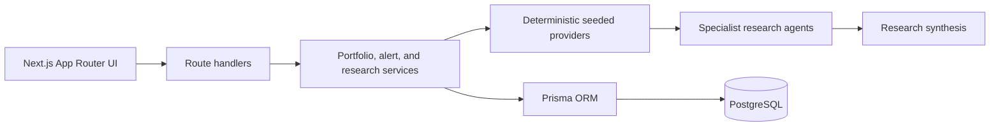

# PortfolioScope

PortfolioScope is a full-stack portfolio analytics and explainable stock-research demo built for long-term investors. It combines period-based performance, holding contribution analysis, deterministic risk alerts, and specialist research agents in a polished recruiter-ready experience.

> This is an educational analytics demo, not a brokerage or financial-advice product. Market and research data are deterministic and seeded; the app does not place trades, predict prices, or issue buy/sell/hold recommendations.

## Product highlights

- Portfolio performance across 1D, 1W, 1M, 3M, and 1Y periods
- Holding-level returns, gain/loss, allocation, and contribution analysis
- Winners, losers, sector allocation, and portfolio value history
- Explainable, rule-based concentration, drawdown, price-move, and watchlist alerts
- Stock detail views with position context, price history, and related risks
- Structured research agents for news, financials, competitors, political activity, and risk
- Deterministic seeded data for a stable, repeatable demo
- Responsive Next.js UI backed by typed services, APIs, Prisma, and PostgreSQL

## Product tour

Screenshot assets are kept in [`public/screenshots`](public/screenshots). The recommended capture set is documented in [`DEMO.md`](DEMO.md); images can be added without changing README copy.

| View         | What it demonstrates                                            |
| ------------ | --------------------------------------------------------------- |
| Landing      | Clear product positioning and one-click demo entry              |
| Dashboard    | Period analytics, allocation, winners/losers, and alert context |
| Holdings     | Comparable return windows and position-level performance        |
| Alerts       | Transparent risk rules with links to affected securities        |
| Stock detail | Price, position, risks, and explainable specialist research     |

## Architecture



The application keeps presentation, orchestration, domain calculations, providers, and persistence separate. Providers supply facts; specialist agents interpret structured inputs; synthesis combines their outputs while preserving findings, confidence, warnings, and sources.

## Tech stack

- Next.js 15, React 19, and TypeScript
- Tailwind CSS and shadcn/ui-style components
- Recharts for portfolio and stock visualizations
- Prisma ORM and PostgreSQL
- Zod for runtime validation
- Vitest for unit and route-level integration tests
- ESLint, Docker, and GitHub Actions

## Run locally

Prerequisites: Node.js 20.19+, npm, and Docker Desktop (or another PostgreSQL 16 instance).

```bash
git clone <your-repository-url>
cd PortfolioScope
cp .env.example .env
npm ci
docker compose up -d postgres
npm run db:deploy
npm run db:seed
npm run dev
```

On Windows PowerShell, replace the copy command with `Copy-Item .env.example .env`.

Open [http://localhost:3000](http://localhost:3000), then select **Continue as demo investor**. The default `.env.example` credentials match the local Docker database.

## Quality checks

```bash
npm run lint
npm run typecheck
npm run test
npm run build
```

CI runs the same checks against PostgreSQL after applying migrations and loading deterministic demo data.

## Demo guide

The focused recruiter walkthrough takes about three minutes:

1. Enter demo mode and establish the product’s analytics-first positioning.
2. Change the dashboard period to show server-side performance recalculation.
3. Compare holding returns and contribution across time windows.
4. Open an alert and explain the deterministic trigger.
5. Open a stock’s research tabs and trace a synthesis insight back to specialist findings and sources.

Detailed talking points, fallback steps, and screenshot framing are in [`DEMO.md`](DEMO.md).

## Deployment

The M11 deployment foundation targets Vercel and Neon PostgreSQL. Runtime traffic uses the pooled `DATABASE_URL`; Prisma migration commands use the direct `DIRECT_URL`. Preview and production must use different Neon databases and environment-scoped Vercel variables.

The repository includes:

- GitHub Actions checks backed by PostgreSQL
- Safe, repeatable Prisma migrations and an idempotent demo-seed integration check
- `GET /api/health` for liveness and `GET /api/ready` for database readiness
- Optional Sentry client, server, edge, and App Router error instrumentation
- A production guard that keeps the public demo read-only
- A multi-stage production `Dockerfile` and local PostgreSQL in `docker-compose.yml`

Follow [`RUNBOOK.md`](RUNBOOK.md) for the environment matrix, first deployment, monitoring, smoke tests, and rollback procedure.

No public demo URL is claimed here until a deployment is verified.

## Project documentation

- [`README.md`](README.md) — product, architecture, setup, deployment, and roadmap
- [`DEMO.md`](DEMO.md) — recruiter walkthrough and screenshot capture checklist

- [`RUNBOOK.md`](RUNBOOK.md) — production deployment, monitoring, and rollback

## Roadmap

- Portfolio and watchlist management with explicit validation
- Replaceable live market-data providers
- Production authentication and user ownership enforcement
- Background research jobs and cache expiry
- Benchmarking, dividends, and portfolio import

Brokerage connectivity, trading, price prediction, and investment recommendations remain outside the product’s scope.
